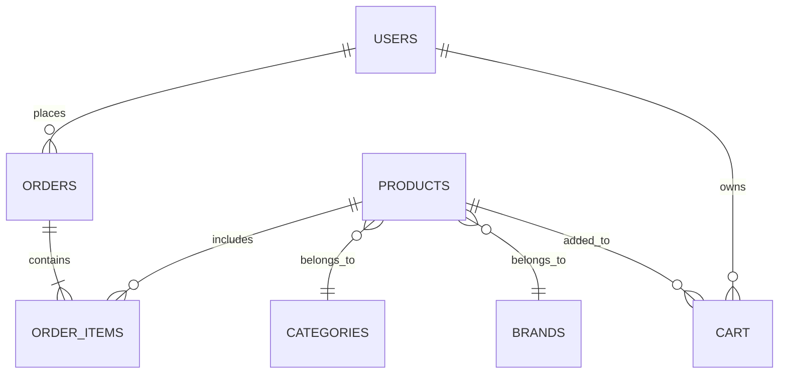

````markdown
# OrderNest – Retail Ordering Platform

OrderNest is a full-stack retail ordering platform developed for the **HCL Hackathon – Code Catalyst**.

The platform enables customers to browse menu items, place orders, and manage their purchase history. Managers can manage products, brands, categories, and monitor incoming orders through an administrative dashboard.

---

## Problem Statement

**Retail Ordering Website**

Develop a platform that allows customers to browse, order, and receive items such as **Pizza, Cold Drinks, and Breads** while ensuring secure and efficient operations.

The system should provide:

- A centralized portal to manage brands, categories, and products  
- A seamless customer ordering experience  
- Inventory updates upon order confirmation  
- Secure APIs for authentication and order management  

---

## Features

### Customer Features

- User registration and authentication  
- Browse menu items by categories  
- Product search and filtering  
- Product cards with images and details  
- Add items to cart with quantity selection  
- Interactive cart drawer  
- Checkout and order placement  
- Order history tracking  
- Quick reorder functionality  
- Profile management  

---

### Manager / Admin Features

- Manager login with role-based access  
- Dashboard analytics displaying:
  - Total orders  
  - Total revenue  
  - Total products  
  - Total categories  

#### Product Management
- Add products  
- Delete products  
- Manage product inventory  

#### Brand Management
- Add brands  
- Delete brands  

#### Category Management
- Add categories  
- Delete categories  

#### Order Monitoring
- View all orders  
- Orders sorted by latest  
- View order item details  

---

## System Architecture

```mermaid
flowchart LR
    A[React Frontend] --> B[REST API Layer]
    B --> C[Spring Boot Backend]
    C --> D[(MySQL Database)]
````

---

## Technology Stack

### Frontend

* React.js
* Axios
* React Router
* Custom CSS

### Backend

* Spring Boot
* REST APIs
* Maven

### Database

* MySQL

### Tools

* Swagger (API documentation)
* GitHub (Version control)

---

## Project Structure

```mermaid
flowchart TD
    A[HCL_Hackathon_code_catalyst]

    A --> B[ordernest-ui]
    A --> C[order_nest]
    A --> D[README.md]

    B --> B1[React Components]
    B --> B2[Pages]
    B --> B3[API Services]

    C --> C1[Controllers]
    C --> C2[Services]
    C --> C3[Repositories]
    C --> C4[Entities]
```

---

## Database Schema

The application uses **MySQL** for persistent data storage.

### Users Table

| Column   | Type    | Description        |
| -------- | ------- | ------------------ |
| id       | BIGINT  | Primary key        |
| name     | VARCHAR | User name          |
| email    | VARCHAR | User email         |
| password | VARCHAR | Encrypted password |
| role     | VARCHAR | USER / MANAGER     |
| mobile   | VARCHAR | Contact number     |
| address  | VARCHAR | Delivery address   |

---

### Categories Table

| Column | Type    | Description   |
| ------ | ------- | ------------- |
| id     | BIGINT  | Primary key   |
| name   | VARCHAR | Category name |

---

### Brands Table

| Column | Type    | Description |
| ------ | ------- | ----------- |
| id     | BIGINT  | Primary key |
| name   | VARCHAR | Brand name  |

---

### Products Table

| Column      | Type    | Description                        |
| ----------- | ------- | ---------------------------------- |
| id          | BIGINT  | Primary key                        |
| name        | VARCHAR | Product name                       |
| price       | DOUBLE  | Product price                      |
| stock       | INT     | Available inventory                |
| food_type   | VARCHAR | VEG / NON_VEG                      |
| rating      | DOUBLE  | Product rating                     |
| category_id | BIGINT  | Foreign key referencing Categories |
| brand_id    | BIGINT  | Foreign key referencing Brands     |

---

### Cart Table

| Column     | Type   | Description                      |
| ---------- | ------ | -------------------------------- |
| id         | BIGINT | Primary key                      |
| user_id    | BIGINT | Foreign key referencing Users    |
| product_id | BIGINT | Foreign key referencing Products |
| quantity   | INT    | Quantity in cart                 |

---

### Orders Table

| Column      | Type      | Description                   |
| ----------- | --------- | ----------------------------- |
| id          | BIGINT    | Primary key                   |
| user_id     | BIGINT    | Foreign key referencing Users |
| total_price | DOUBLE    | Total order price             |
| status      | VARCHAR   | Order status                  |
| created_at  | TIMESTAMP | Order timestamp               |

---

### Order Items Table

| Column     | Type   | Description                      |
| ---------- | ------ | -------------------------------- |
| id         | BIGINT | Primary key                      |
| order_id   | BIGINT | Foreign key referencing Orders   |
| product_id | BIGINT | Foreign key referencing Products |
| quantity   | INT    | Quantity ordered                 |
| price      | DOUBLE | Product price                    |

---

## Entity Relationships



---

## Setup and Installation

### Clone the Repository

```
git clone https://github.com/Srinidhi945/HCL_Hackathon_code_catalyst.git
```

Navigate to the project directory:

```
cd HCL_Hackathon_code_catalyst
```

---

## Running the Backend

Navigate to the backend folder:

```
cd order_nest
```

Run the Spring Boot application:

```
./mvnw spring-boot:run
```

Backend will start at:

```
http://localhost:8080
```

Swagger API documentation:

```
http://localhost:8080/swagger-ui/index.html
```

---

## Running the Frontend

Navigate to the frontend folder:

```
cd ordernest-ui
```

Install dependencies:

```
npm install
```

Run the application:

```
npm start
```

Frontend will start at:

```
http://localhost:3000
```

---

## Core Functionalities Delivered

* Centralized portal for brands, categories, and products
* Menu browsing, cart management, and order placement
* Automatic inventory updates after order confirmation
* Role-based authentication (Customer / Manager)
* REST APIs documented using Swagger
* Version-controlled codebase using GitHub

---

## Additional Features

* Order history tracking
* Quick reorder functionality
* Manager analytics dashboard
* Inventory management

---

## Contributors

* Harshith Rao
* Rakesh Mayakoti
* Hemanth Guntikadi
* Srinidhi Poreddy

---

## Demo

A demo video of the application will be added here.

---

## License

This project was developed as part of the **HCL Hackathon – Code Catalyst**.

```
```
